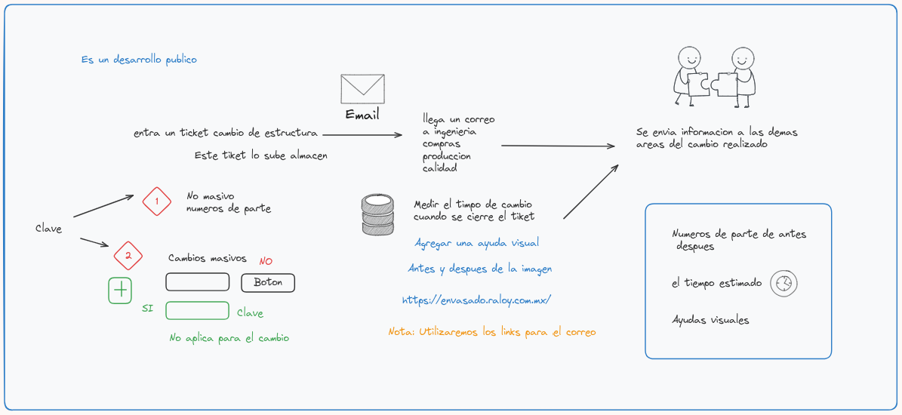

# 📋 Proyecto de Cambio de Estructura
Este proyecto es un desarrollo público que automatiza el proceso de cambio de estructura en nuestra empresa.  
Aquí te explicamos cómo funciona paso a paso.

## 📥 Ingreso del Ticket
Un ticket de cambio de estructura es ingresado por el almacén. 
Este ticket es revisado para determinar si se trata de un cambio masivo de números de parte: 
🔴 No masivo: El proceso sigue con una revisión manual. 
🟢 Masivo: Se utiliza una clave y un botón para proceder automáticamente.

## 📧 Notificación por Email
Cuando se ingresa un ticket, se envía un correo electrónico a los departamentos de:
- 🛠️ Ingeniería
- 📦 Compras
- 🏭 Producción
- 🔍 Calidad

## ⏲️ Medición del Tiempo de Cambio
Se mide el tiempo de cambio cuando se cierra el ticket. 
Esta información es enviada a las áreas involucradas para tener un registro del cambio realizado.

## 📝 Detalles del Cambio
Los detalles incluyen: 
Números de parte antes y después del cambio. 
El tiempo estimado del cambio. 
Ayudas visuales para entender el proceso.